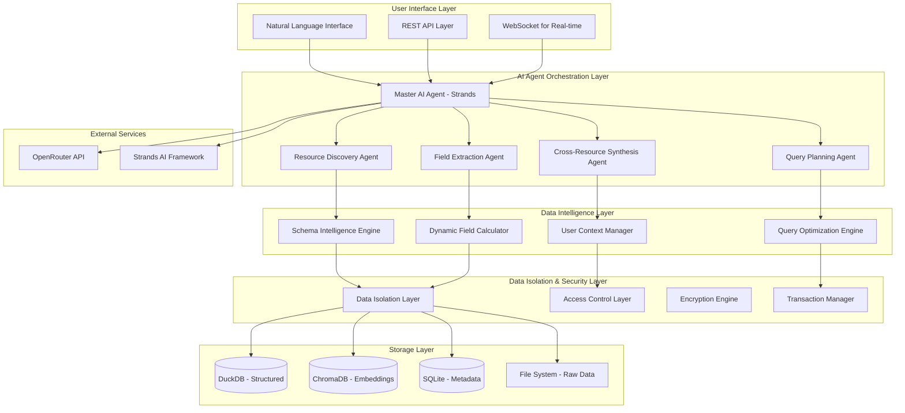

# Design Document: Intelligent AI Data Analyst System

## Overview

The Intelligent AI Data Analyst System is a complete redesign of the data retrieval layer, built on the Strands AI agent framework. The system uses multiple specialized AI agents working together to provide intelligent, conversational data analysis across all user data formats. The architecture ensures strict data isolation, ACID compliance, and natural language interaction capabilities.

## Architecture

### High-Level Architecture



### Component Architecture

#### 1. Master AI Agent (Strands-Powered)

The central orchestrating agent built on the Strands framework that coordinates all data analysis activities.

**Key Features:**
- Natural language understanding and conversation management
- Agent-to-agent communication for complex queries
- Context management across multiple interactions
- Intelligent query routing and result synthesis

**Strands Configuration:**
```python
from strands import Agent
from strands.models import BedrockModel  # Using OpenRouter via Bedrock
from strands_tools import python_repl, http_request

master_agent = Agent(
    model=BedrockModel(
        model_id="anthropic.claude-sonnet-4-20250514-v1:0",
        temperature=0.3,  # Lower for analytical tasks
        max_tokens=4096
    ),
    tools=[
        resource_discovery_tool,
        field_extraction_tool,
        query_execution_tool,
        data_synthesis_tool,
        python_repl  # For complex calculations
    ],
    system_prompt="""You are an expert AI Data Analyst with access to a user's complete dataset.
    
    Your capabilities:
    1. Understand natural language queries about data
    2. Discover and analyze data across multiple formats (CSV, JSON, text)
    3. Extract and derive complex fields intelligently
    4. Synthesize information from multiple data sources
    5. Provide insights, trends, and comprehensive analysis
    
    Always:
    - Explain your reasoning and methodology
    - Cite data sources used in analysis
    - Ask clarifying questions when queries are ambiguous
    - Provide actionable insights and recommendations
    - Maintain conversation context for follow-up questions
    
    You have access to specialized tools for data discovery, field extraction, and query execution.
    Use these tools to provide comprehensive, accurate analysis."""
)
```

#### 2. Specialized AI Agents

**Resource Discovery Agent:**
- Automatically catalogs all user data sources
- Understands schema relationships across formats
- Maps field names and data types intelligently
- Identifies potential join keys and relationships

**Field Extraction Agent:**
- Analyzes desired fields against available data
- Performs intelligent field mapping and derivation
- Calculates complex derived fields using AI reasoning
- Handles cross-resource field synthesis

**Query Planning Agent:**
- Creates optimal execution plans for complex queries
- Implements streaming and pagination for large datasets
- Manages parallel execution and resource allocation
- Optimizes performance based on data characteristics

**Cross-Resource Synthesis Agent:**
- Combines data from multiple sources intelligently
- Resolves schema conflicts and data type mismatches
- Creates unified views across different data formats
- Maintains data lineage and source attribution

## Components and Interfaces

### 1. Natural Language Interface

```python
class NaturalLanguageInterface:
    """
    AI-powered natural language interface for conversational data analysis.
    """
    
    def __init__(self, master_agent: Agent, user_context_manager: UserContextManager):
        self.master_agent = master_agent
        self.user_context_manager = user_context_manager
        self.conversation_history = {}
    
    async def process_query(self, user_id: str, client_id: str, 
                          query: str, context: Dict[str, Any] = None) -> AnalysisResult:
        """Process natural language query with full AI intelligence."""
        
    async def continue_conversation(self, user_id: str, client_id: str,
                                  follow_up: str) -> AnalysisResult:
        """Handle follow-up questions maintaining context."""
        
    async def explain_result(self, user_id: str, client_id: str,
                           result_id: str) -> ExplanationResult:
        """Provide detailed explanation of analysis methods and results."""
```

### 2. Data Isolation Layer

```python
class DataIsolationLayer:
    """
    Ensures complete data isolation and ACID compliance.
    """
    
    def __init__(self, encryption_engine: EncryptionEngine, 
                 transaction_manager: TransactionManager):
        self.encryption_engine = encryption_engine
        self.transaction_manager = transaction_manager
        self.user_namespaces = {}
    
    async def create_user_namespace(self, client_id: str, user_id: str) -> UserNamespace:
        """Create isolated namespace for user data."""
        
    async def execute_isolated_query(self, user_namespace: UserNamespace,
                                   query: QueryPlan) -> QueryResult:
        """Execute query within user's isolated environment."""
        
    async def validate_data_access(self, user_id: str, client_id: str,
                                 resource_ids: List[str]) -> bool:
        """Validate user can access specified resources."""
```

### 3. Schema Intelligence Engine

```python
class SchemaIntelligenceEngine:
    """
    AI-powered schema understanding and mapping across data formats.
    """
    
    def __init__(self, schema_agent: Agent):
        self.schema_agent = schema_agent
        self.schema_cache = {}
        self.field_mappings = {}
    
    async def analyze_schema(self, resource_metadata: ResourceMetadata) -> SchemaAnalysis:
        """Analyze and understand data schema using AI."""
        
    async def map_fields(self, desired_fields: Dict[str, str],
                        available_schemas: List[SchemaAnalysis]) -> FieldMapping:
        """Map desired fields to available data using AI reasoning."""
        
    async def suggest_derivations(self, missing_fields: List[str],
                                available_fields: List[str]) -> List[DerivationSuggestion]:
        """Suggest how to derive missing fields from available data."""
```

### 4. Dynamic Field Calculator

```python
class DynamicFieldCalculator:
    """
    AI-powered field derivation and calculation engine.
    """
    
    def __init__(self, calculation_agent: Agent):
        self.calculation_agent = calculation_agent
        self.derivation_cache = {}
    
    async def calculate_derived_field(self, field_definition: DerivedFieldDefinition,
                                    source_data: Dict[str, Any]) -> Any:
        """Calculate derived field using AI reasoning and Python execution."""
        
    async def validate_calculation(self, calculation: str,
                                 source_fields: List[str]) -> ValidationResult:
        """Validate calculation logic and field dependencies."""
        
    async def optimize_calculation(self, calculation: str,
                                 data_size: int) -> OptimizedCalculation:
        """Optimize calculation for performance based on data characteristics."""
```

## Data Models

### Core Data Models

```python
@dataclass
class AnalysisRequest:
    """Request for AI data analysis."""
    user_id: str
    client_id: str
    query: str
    desired_fields: Optional[Dict[str, str]] = None
    optional_fields: Optional[Dict[str, str]] = None
    derived_fields: Optional[Dict[str, DerivedFieldDefinition]] = None
    context: Optional[Dict[str, Any]] = None
    conversation_id: Optional[str] = None

@dataclass
class DerivedFieldDefinition:
    """Definition for a derived field calculation."""
    description: str
    calculation: str
    source_fields: List[str]
    data_type: str
    validation_rules: Optional[List[str]] = None

@dataclass
class AnalysisResult:
    """Result of AI data analysis."""
    query_id: str
    user_id: str
    client_id: str
    results: List[Dict[str, Any]]
    insights: List[str]
    methodology: str
    sources_used: List[str]
    confidence_score: float
    execution_time_ms: float
    follow_up_suggestions: List[str]
    visualizations: Optional[List[VisualizationSpec]] = None

@dataclass
class UserNamespace:
    """Isolated namespace for user data."""
    user_id: str
    client_id: str
    encryption_key: str
    database_schema: str
    storage_path: str
    access_permissions: Dict[str, Any]
    created_at: datetime
    last_accessed: datetime

@dataclass
class SchemaAnalysis:
    """AI analysis of data schema."""
    resource_id: str
    schema_type: str  # structured, json, unstructured
    fields: List[FieldAnalysis]
    relationships: List[RelationshipAnalysis]
    data_quality_score: float
    semantic_tags: List[str]
    suggested_joins: List[JoinSuggestion]

@dataclass
class FieldAnalysis:
    """AI analysis of individual field."""
    name: str
    data_type: str
    semantic_type: str  # e.g., "person_name", "monetary_amount", "date"
    nullable: bool
    unique_values: int
    sample_values: List[Any]
    quality_score: float
    suggested_mappings: List[str]
```

### Advanced Data Models

```python
@dataclass
class QueryPlan:
    """AI-generated query execution plan."""
    plan_id: str
    original_query: str
    execution_steps: List[ExecutionStep]
    estimated_cost: float
    estimated_time_ms: float
    resource_requirements: ResourceRequirements
    optimization_notes: List[str]
    fallback_plans: List['QueryPlan']

@dataclass
class ExecutionStep:
    """Individual step in query execution."""
    step_id: str
    step_type: str  # discovery, extraction, calculation, synthesis
    agent_assigned: str
    input_dependencies: List[str]
    output_schema: Dict[str, str]
    estimated_time_ms: float
    parallelizable: bool

@dataclass
class CrossResourceSynthesis:
    """Result of synthesizing data across multiple resources."""
    synthesis_id: str
    source_resources: List[str]
    unified_schema: Dict[str, str]
    join_strategy: str
    data_transformations: List[str]
    quality_metrics: Dict[str, float]
    lineage_tracking: Dict[str, List[str]]
```

## Correctness Properties

*A property is a characteristic or behavior that should hold true across all valid executions of a system—essentially, a formal statement about what the system should do. Properties serve as the bridge between human-readable specifications and machine-verifiable correctness guarantees.*

### Property 1: Complete Data Isolation
*For any* two different users (user1, user2) with the same client_id, when user1 queries their data, the results should never contain any data that belongs to user2, regardless of query complexity or system load.
**Validates: Requirements 4.1, 4.2, 11.2**

### Property 2: AI Query Intelligence
*For any* natural language query about user data, the AI system should identify at least one relevant data source and provide a meaningful response, even if the exact requested fields don't exist in the original form.
**Validates: Requirements 1.1, 1.2, 1.3**

### Property 3: Field Derivation Consistency
*For any* derived field calculation, when applied to the same source data multiple times, the system should produce identical results, and the calculation should be explainable and traceable to source fields.
**Validates: Requirements 2.3, 2.4, 8.2**

### Property 4: Schema Intelligence Accuracy
*For any* uploaded data resource, the AI schema analysis should correctly identify at least 90% of field types and suggest semantically meaningful field mappings when similar fields exist across resources.
**Validates: Requirements 3.1, 3.2, 7.1, 7.2**

### Property 5: ACID Transaction Compliance
*For any* sequence of data operations (upload, query, update, delete), the system should maintain atomicity, consistency, isolation, and durability, with no partial states visible to users during transaction processing.
**Validates: Requirements 4.4, 4.5, 11.1**

### Property 6: Conversational Context Preservation
*For any* conversation thread, when a user asks follow-up questions, the AI should maintain context from previous queries and provide responses that build upon earlier analysis without requiring re-explanation of context.
**Validates: Requirements 6.1, 6.2, 6.3**

### Property 7: Cross-Format Data Integration
*For any* combination of structured, JSON, and unstructured data belonging to a user, the AI system should be able to create unified queries that span all formats and provide coherent results that preserve data relationships.
**Validates: Requirements 7.3, 7.4, 7.5**

### Property 8: Performance Scalability
*For any* dataset size up to the system limits, query response times should remain within acceptable bounds (< 30 seconds for complex analysis), and the system should gracefully handle resource constraints through streaming and optimization.
**Validates: Requirements 10.1, 10.2, 10.4**

### Property 9: Error Recovery and Graceful Degradation
*For any* query that encounters errors (missing data, schema conflicts, calculation failures), the system should provide helpful error messages, suggest alternatives, and attempt to provide partial results when possible.
**Validates: Requirements 9.1, 9.2, 9.3, 9.4**

### Property 10: Security and Privacy Enforcement
*For any* system operation involving user data, all data should be encrypted at rest and in transit, access should be validated against user permissions, and no sensitive information should be exposed in logs or error messages.
**Validates: Requirements 11.1, 11.3, 11.4, 11.5**

## Error Handling

### AI Agent Error Recovery

The system implements multi-layered error handling with AI-powered recovery:

1. **Agent-Level Recovery**: Each Strands agent has built-in error handling and can request help from other agents
2. **Query Fallback**: When complex queries fail, the system automatically generates simpler fallback queries
3. **Partial Results**: When complete analysis isn't possible, the system provides partial results with clear limitations
4. **User Guidance**: AI agents provide helpful error messages and suggest query modifications

### Data Integrity Protection

1. **Transaction Rollback**: All operations are wrapped in transactions with automatic rollback on failure
2. **Consistency Checks**: Regular validation of data integrity across all storage layers
3. **Isolation Verification**: Continuous monitoring to ensure no cross-user data leakage
4. **Backup and Recovery**: Automated backup systems with point-in-time recovery capabilities

## Testing Strategy

### Dual Testing Approach

**Unit Tests:**
- Test individual AI agent responses and tool functions
- Validate data isolation mechanisms
- Test schema analysis accuracy
- Verify field derivation calculations
- Test error handling scenarios

**Property-Based Tests:**
- Validate data isolation across random user combinations
- Test AI intelligence with generated natural language queries
- Verify ACID compliance under concurrent operations
- Test schema intelligence with various data formats
- Validate performance characteristics under load

**Integration Tests:**
- End-to-end conversational analysis scenarios
- Cross-format data integration workflows
- Multi-user concurrent access patterns
- System recovery and failover procedures
- Security and privacy compliance validation

### AI Agent Testing

**Strands Agent Testing:**
- Test agent responses with various query types
- Validate tool usage and agent-to-agent communication
- Test conversation context management
- Verify reasoning quality and explanation accuracy
- Test performance under different model configurations

**Property Test Configuration:**
- Minimum 100 iterations per property test
- Each test tagged with: **Feature: intelligent-data-analyst, Property {number}: {property_text}**
- Use realistic data generators for comprehensive coverage
- Test with multiple AI model configurations
- Validate consistency across different execution environments