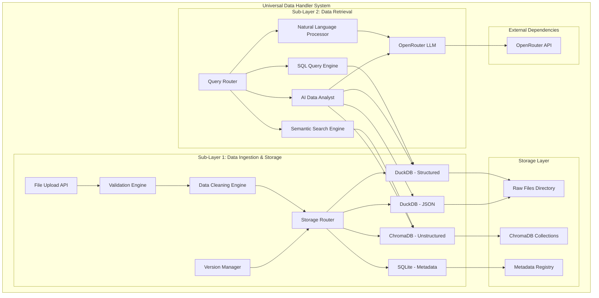
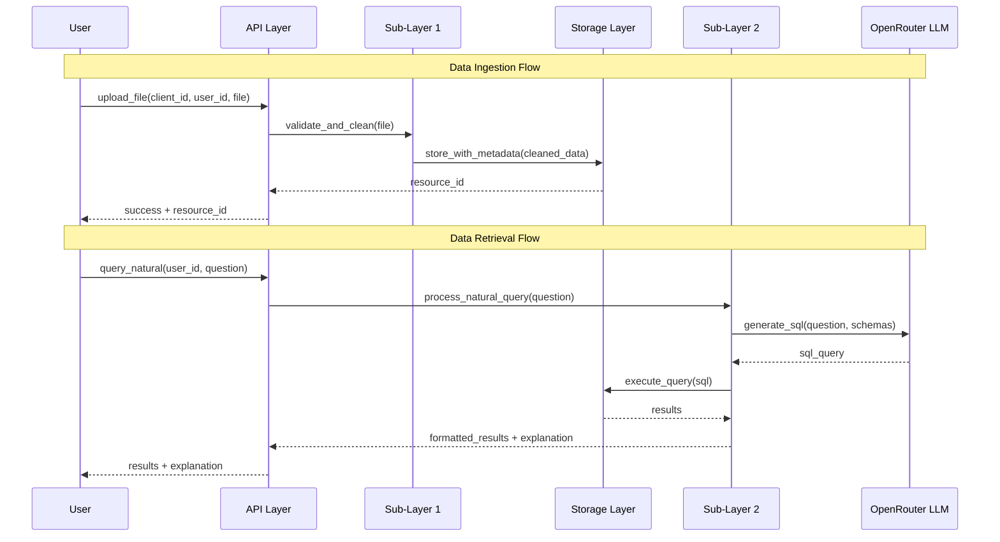

# Design Document: Universal Data Handler

## Overview

The Universal Data Handler is a comprehensive on-premises data management system that provides automated ingestion, cleaning, storage, and intelligent retrieval of multi-format data. The system is architected as Layer 1 of the light_ai multi-layer system, designed to work entirely on-premises with zero external dependencies except OpenRouter API for LLM capabilities.

The system implements a two-sub-layer architecture:
- **Sub-Layer 1**: Data Ingestion & Storage - handles upload, validation, cleaning, storage, and versioning
- **Sub-Layer 2**: Data Retrieval - handles querying, searching, analysis, and export operations

Key design principles:
- **Zero-configuration**: Works out-of-the-box with pip install
- **On-premises first**: All data stays local, no cloud dependencies
- **Performance-optimized**: Sub-second query responses for most operations
- **Multi-format support**: Handles structured, JSON, and unstructured data seamlessly
- **AI-powered**: Natural language queries and intelligent data analysis

## Architecture

### High-Level System Architecture



### Data Flow Architecture



## Components and Interfaces

### Sub-Layer 1: Data Ingestion & Storage Components

#### 1. File Upload API
**Purpose**: Entry point for all data ingestion operations
**Technology**: Python with FastAPI or Flask
**Key Methods**:
```python
def upload_file(client_id: str, user_id: str, file_path: str, 
                resource_name: str = None, cleaning_config: dict = None) -> str
def upload_json(client_id: str, user_id: str, json_data: dict | list, 
                resource_name: str, flatten: bool = False) -> str
def upload_bulk(client_id: str, user_id: str, files: list[str], 
                parallel: bool = True) -> list[str]
def update_resource(resource_id: str, new_data: str | dict, 
                    create_version: bool = True) -> int
def delete_resource(resource_id: str, hard_delete: bool = False) -> bool
```

#### 2. Validation Engine
**Purpose**: Validates file formats, sizes, and data integrity
**Technology**: Python with pandas, polars for data validation
**Responsibilities**:
- File format detection and validation
- Size limit enforcement (default 500MB)
- Data parseability checks
- Duplicate detection using hash-based comparison
- Schema validation for structured data

#### 3. Data Cleaning Engine
**Purpose**: Automated data standardization and cleaning
**Technology**: Python with pandas/polars for data manipulation
**Cleaning Rules**:
- **Structured Data**: Remove empty rows/columns, strip whitespace, normalize column names, detect data types, handle missing values
- **JSON Data**: Flatten nested structures (configurable), normalize keys, remove null objects
- **Unstructured Data**: Extract clean text, remove headers/footers, semantic chunking (512 tokens, 50 overlap)

#### 4. Storage Router
**Purpose**: Routes data to appropriate storage systems based on type
**Technology**: Python with database-specific drivers
**Routing Logic**:
- Structured files (CSV, Excel, Parquet) → DuckDB virtual tables
- JSON data → DuckDB JSONB storage
- Unstructured files (PDF, TXT, DOCX) → ChromaDB embeddings
- Metadata → SQLite registry

#### 5. Version Manager
**Purpose**: Handles data versioning and audit trails
**Technology**: Python with file system operations and SQLite
**Features**:
- Non-destructive updates (preserve all versions)
- Automatic version incrementing
- Complete audit trail logging
- Rollback capabilities

### Sub-Layer 2: Data Retrieval Components

#### 1. Query Router
**Purpose**: Routes queries to appropriate processing engines
**Technology**: Python with query parsing and routing logic
**Routing Logic**:
- SQL queries → SQL Query Engine
- Natural language → Natural Language Processor
- Semantic search → Semantic Search Engine
- Complex analysis → AI Data Analyst

#### 2. SQL Query Engine
**Purpose**: Executes SQL queries against structured data
**Technology**: DuckDB Python API
**Features**:
- Direct CSV/Excel querying via virtual tables
- JSONB querying for JSON data
- Cross-resource joins
- Query optimization and caching
- Streaming results for large datasets (>10,000 rows)

#### 3. Natural Language Processor
**Purpose**: Converts natural language to SQL queries
**Technology**: OpenRouter API with schema-aware prompting
**Process**:
1. Retrieve relevant schemas for user's resources
2. Construct schema-aware prompt with question
3. Send to OpenRouter LLM (Claude 3.5 Sonnet recommended)
4. Parse and validate generated SQL
5. Execute query and return results with explanation

#### 4. Semantic Search Engine
**Purpose**: Performs AI-powered search on unstructured data
**Technology**: ChromaDB with OpenRouter embeddings
**Search Strategies**:
- **Semantic**: Pure embedding-based similarity
- **Keyword**: Traditional text matching
- **Hybrid**: Combination of semantic and keyword
- **MMR (Maximal Marginal Relevance)**: Diverse result selection
- **Multi-query**: Generate query variations for better coverage

#### 5. AI Data Analyst
**Purpose**: Provides comprehensive data analysis across all data types
**Technology**: OpenRouter LLM with multi-step reasoning
**Capabilities**:
- Automatic resource identification
- Cross-format data synthesis
- Trend analysis and insights generation
- Report generation with visualizations
- Source citation and reasoning explanation

## Data Models

### Core Data Hierarchy
```python
@dataclass
class DataHierarchy:
    client_id: str      # UUID v4 - Organization identifier
    user_id: str        # UUID v4 - Individual user identifier  
    resource_id: str    # UUID v4 - Unique data resource identifier
```

### Resource Metadata Model
```python
@dataclass
class ResourceMetadata:
    resource_id: str
    user_id: str
    client_id: str
    resource_type: str          # 'structured', 'json', 'unstructured'
    data_type: str             # 'csv', 'pdf', 'json', etc.
    original_filename: str
    file_size_bytes: int
    row_count: Optional[int]    # For structured data
    column_count: Optional[int] # For structured data
    chunk_count: Optional[int]  # For unstructured data
    storage_path: str
    created_at: datetime
    updated_at: datetime
    version: int
    is_deleted: bool
```

### Schema Registry Model
```python
@dataclass
class SchemaInfo:
    schema_id: str
    resource_id: str
    version: int
    schema_json: str           # JSON representation of column definitions
    statistics_json: str       # Data profiling statistics
    detected_at: datetime
```

### Storage Directory Structure
```
data-extraction-system/
├── data/
│   ├── structured/
│   │   └── {client_id}/
│   │       └── {user_id}/
│   │           └── {resource_id}/
│   │               ├── v1_original.csv
│   │               ├── v1_schema.json
│   │               ├── v2_original.csv
│   │               └── current -> v2_original.csv
│   ├── json/
│   │   └── json_store.duckdb
│   ├── unstructured/
│   │   └── chroma_db/
│   └── raw/
│       └── {client_id}/
│           └── {user_id}/
│               └── {resource_id}/
├── metadata/
│   └── registry.db
├── cache/
│   └── query_cache/
└── logs/
    └── operations.log
```

## Correctness Properties

*A property is a characteristic or behavior that should hold true across all valid executions of a system-essentially, a formal statement about what the system should do. Properties serve as the bridge between human-readable specifications and machine-verifiable correctness guarantees.*

Now I'll analyze the acceptance criteria to determine which ones are testable as properties:
